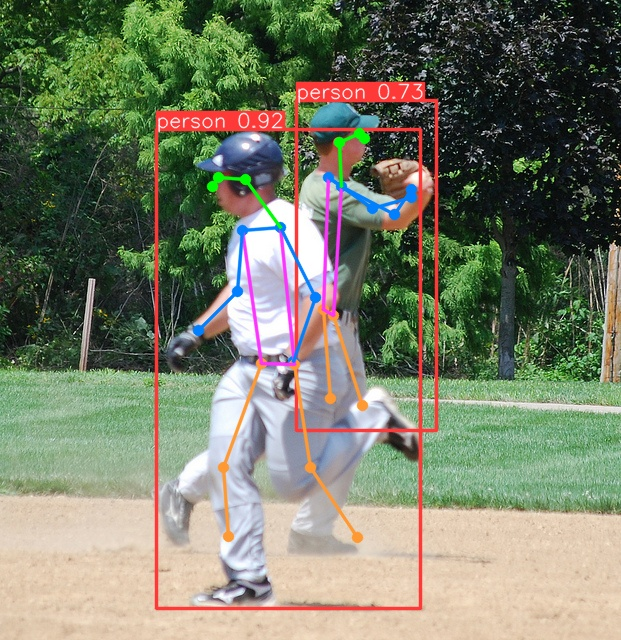

# YOLOv9-POSE

This repository takes the Human Pose Estimation model from the YOLOv9 model as implemented in YOLOv9's official documentation.

Implementation of paper - [YOLOv9: Learning What You Want to Learn Using Programmable Gradient Information](https://arxiv.org/abs/2402.13616)

<div align="center">
    <a href="./">
        
    </a>
</div>

## Performance 

MS COCO

| Model | Test Size  | mAP<sub>50</sub><sup>pose</sup> | mAP<sub>75</sub><sup>pose</sup> | Speed(ms) | Param. | GFLOPs |
| :-- | :-: | :-: | :-: | :-: | :-: | :-: |
| [**YOLOv9n-POSE**](https://github.com/senseable-ai/yolov9-pose/blob/main/weights/YOLOv9-best.pt) | 640 | **60.2%** | **86.6%** | **5.1ms** | **32M** | **121.1G** |
* mAP</sub><sup>pose</sup> values are for single-model single-scale on [COCO Keypoints val2017 dataset](https://cocodataset.org/#home)

## Prerequisites
* Python >= 3.8
* Pytorch >= 1.7.0

## Inference(Python Shell)
``` shell
from ultralytics import YOLO

model = YOLO('./weights/YOLOv9-best.pt')
model.predict('./demo/000000000885.jpg', save=True, conf=0.6)
```

## Usage

Setup Conda Environment
``` shell
$ conda create --name yolov9 python=3.8
$ conda activate yolov9
```
Clone Repository(Unofficial / branch name: [yolo9u](https://github.com/WongKinYiu/yolov9/tree/yolov9u)
``` shell
$ git clone https://github.com/WongKinYiu/yolov9.git@yolov9u
```
Download Ultralytics
``` shell
$ pip install ultralytic==8.1.23
$ pip install torch==1.13.0 torchvision==0.14.0 torchaudio==0.13.0
```
Training
``` shell
$ yolo pose train data=coco-pose.yaml model=yolov9-pose.yaml epochs=100 imgsz=640
```
Validation
``` shell
yolo pose val model=path/to/best.pt  # val custom model
```

## Reference

* [https://github.com/WongKinYiu/yolov9](https://github.com/WongKinYiu/yolov9)


